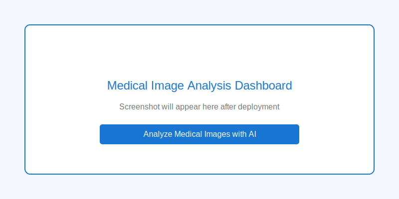

# Medical Image Analysis Web Application

An advanced medical image analysis application leveraging deep learning for disease detection in X-ray images, with visual explanations and segmentation.



## Features

- **Medical Image Classification**: Analyzes chest X-rays to detect potential diseases
- **Segmentation**: Highlights regions of interest with segmentation masks
- **Explainable AI**: Uses Grad-CAM to visualize what the model focuses on, providing transparent results
- **Uncertainty Estimation**: Implements Monte Carlo dropout for confidence scoring
- **Modern UI**: Intuitive React-based user interface with responsive design
- **User Authentication**: Secure login and registration system
- **History Tracking**: Saves and displays previous analyses for review

## Tech Stack

### Backend
- FastAPI - High-performance web framework for building APIs with Python
- PyTorch - Deep learning framework for neural networks
- SQLAlchemy - Database ORM for data persistence
- JWT - JSON Web Tokens for authentication

### Frontend
- React - JavaScript library for building user interfaces
- Material-UI - Component library for consistent design
- Recharts - Charting library for data visualization
- React Router - Navigation management

### DevOps
- Docker - Container platform for packaging and deployment
- AWS - Cloud infrastructure (recommended for deployment)

## Architecture

The application follows a modern, full-stack architecture:

1. **Frontend Layer**: React-based SPA with responsive design
2. **API Layer**: FastAPI endpoints for authentication, image upload, and predictions
3. **Deep Learning Layer**: PyTorch models for classification and segmentation
4. **Database Layer**: PostgreSQL database to store user data and prediction history
5. **Storage Layer**: File system storage for images and results

## Getting Started

### Prerequisites

- Python 3.9+
- Node.js 14+
- Docker (optional, for containerization)

### Installation

1. Clone the repository:
   ```
   git clone https://github.com/yourusername/medical-image-analysis-app.git
   cd medical-image-analysis-app
   ```

2. Install backend dependencies:
   ```
   pip install -r requirements.txt
   ```

3. Install frontend dependencies:
   ```
   cd frontend
   npm install
   cd ..
   ```

4. Create necessary directories:
   ```
   mkdir -p app/public/images/uploads app/public/images/heatmaps app/public/images/segmentations app/models/weights
   ```

### Running the Application

1. Start the backend server:
   ```
   uvicorn app.main:app --reload
   ```

2. In a separate terminal, start the frontend:
   ```
   cd frontend
   npm start
   ```

3. Access the application at `http://localhost:3000`

### Docker Deployment

Build and run using Docker:

```
docker build -t medical-image-analysis .
docker run -p 8000:8000 medical-image-analysis
```

Access the application at `http://localhost:8000`

## Model Training

The application includes training scripts for the deep learning models. To train the models:

1. Download the dataset (e.g., [ChestX-ray14](https://nihcc.app.box.com/v/ChestXray-NIHCC))
2. Organize data in the following structure:
   ```
   app/data/
     ├── train/
     │   ├── normal/
     │   └── pneumonia/
     └── val/
         ├── normal/
         └── pneumonia/
   ```
3. Run the training script:
   ```
   python -m app.train
   ```

## Deployment on AWS

The application is designed to be deployed on AWS infrastructure:

1. Use EC2 or ECS for container hosting
2. S3 for image storage
3. RDS for PostgreSQL database
4. CloudFront for content delivery (optional)

See the `docs/deployment.md` file for detailed deployment instructions.

## Ethical Considerations

This application is designed for educational and research purposes only. It should not be used for clinical diagnosis. Always consult with healthcare professionals for medical advice.

## License

This project is licensed under the MIT License - see the LICENSE file for details.

## Acknowledgments

- [ChestX-ray14 dataset](https://nihcc.app.box.com/v/ChestXray-NIHCC) from the NIH Clinical Center
- PyTorch team for their excellent deep learning framework
- FastAPI and React communities for their libraries and documentation 